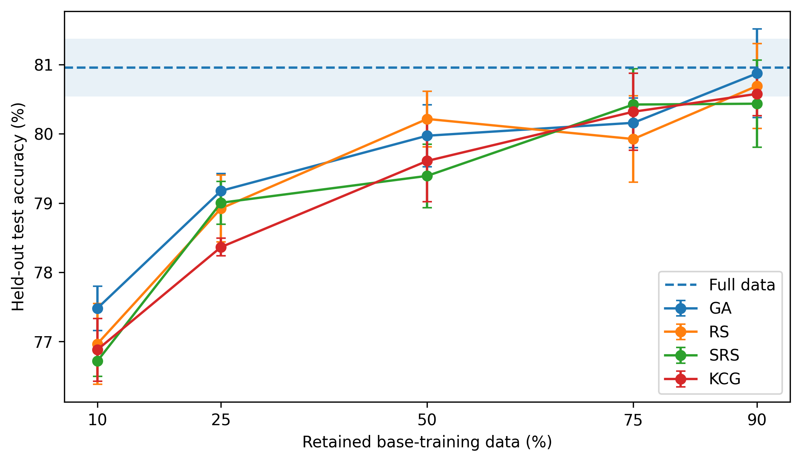
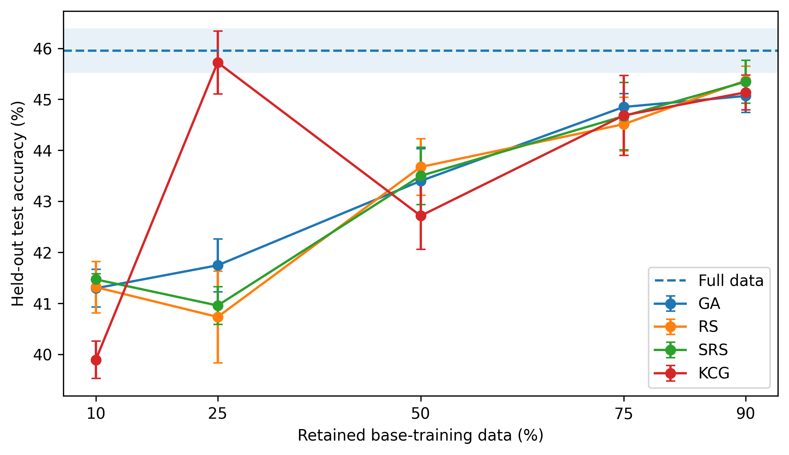

# Metaheuristic-Based Instance Selection for Compact Training of Deep Neural Networks

Code, experiment artifacts, and analysis used in the Master's Thesis **“Metaheuristic-Based Instance Selection for Compact Training of Deep Neural Networks.”**

The project studies fixed-cardinality training-set selection for image classification under a **frozen ImageNet-pretrained representation + fresh linear classifier** protocol. Candidate subsets are evaluated on an internal validation split, while the held-out test set remains untouched until the selected subset is retrained for final evaluation.

## Experimental design

The study follows two stages:

- **Preliminary screening (MNIST):** AlexNet, ResNeXt-50, EfficientNetV2-S, and Swin-T are combined with Random Search (RS), Large Neighborhood Search (LNS), a Genetic Algorithm (GA), and a Memetic Algorithm (MA). Five retention levels (10%, 25%, 50%, 75%, 90%) and five seeds are evaluated with a budget of **100 candidate evaluations per search**.
- **Main study (CIFAR-10 and Tiny ImageNet):** the selected frozen representation (AlexNet) is used with GA and RS under a larger **B=1000** search budget. Two non-wrapper baselines are added: **Single Stratified Random Sample (SRS)** and **global k-center greedy (KCG)**, together with the **100% full-data** reference.

The definitive experiments use cached frozen features, so only the linear classifier is trained during candidate evaluation.

## Main results

The repository contains the complete experiment outputs used in the thesis. The main observations are:

- **MNIST screening:** AlexNet + GA obtained the highest aggregate validation accuracy (**96.976%**) and was selected descriptively for the main stage.
- **CIFAR-10:** GA reached **80.87%** held-out accuracy at 90% retention, compared with **80.95%** using the full base-training set.
- **Tiny ImageNet:** global KCG reached **45.72%** at 25% retention, compared with **45.95%** for the full-data baseline.
- The enlarged B=1000 budget mattered: only **10%** of definitive GA/RS runs had already found their eventual best solution by evaluation 100.

The thesis interpretation is deliberately conservative: no subset-selection method dominates all datasets and retention levels, and expensive wrapper search provides only small and inconsistent gains over simpler baselines.

## Repository structure

```text
.
├── algorithms/                     # RS, LNS, GA, MA, SRS and KCG implementations
├── utils/                          # data, training, configuration and selection utilities
├── notebooks/
│   └── final_results_analysis.ipynb
├── scripts/
│   └── slurm/                      # experiment launch scripts used on DaSCI infrastructure
│       └── legacy/                 # earlier B=100 / preliminary launch scripts
├── results/
│   ├── preliminary/mnist/          # definitive MNIST screening runs
│   ├── main/guided_b1000/          # definitive GA/RS main-stage runs
│   ├── main/srs/                   # SRS baselines
│   ├── main/kcg/                   # global KCG baselines
│   ├── main/full_data/             # 100% full-data baselines
│   └── diagnostics/guided_b100/    # earlier CIFAR-10/Tiny ImageNet B=100 runs
├── analysis_outputs/               # tables and figures regenerated by the notebook
├── data/                           # datasets/features are intentionally not tracked
├── docs/                           # reproducibility and experiment notes
├── extract_features.py             # frozen-feature extraction
├── run_experiments.py              # main experimental runner
└── run_global_kcenter_experiments.py
```

The Python implementation used for the experiments is kept unchanged. The repository reorganization only separates launch scripts, archived results, documentation, and analysis artifacts.

## Environment

The definitive experiment manifests report:

- Python 3.12.13
- PyTorch 2.5.1 + CUDA 12.1
- Torchvision 0.20.1 + CUDA 12.1
- NumPy 2.5.1
- scikit-learn 1.9.0

Install the Python dependencies with:

```bash
pip install -r requirements.txt
```

For GPU reproduction, install the PyTorch build appropriate for the local CUDA/driver setup.

## Data and cached features

Large data artifacts are **not included in Git**.

- MNIST and CIFAR-10 are downloaded automatically by the data-loading code when needed.
- Tiny ImageNet must be available as `data/tiny-imagenet-200/` using the standard dataset layout.
- Frozen feature tensors are generated with `extract_features.py` (or the corresponding Slurm script) and stored under `data/features/<DATASET>/<MODEL>/`.
- KCG additionally creates a reusable pairwise-distance cache. These feature and distance artifacts require tens of gigabytes and are intentionally excluded from the repository.

See [`data/README.md`](data/README.md) for the expected layout.

## Reproducing the experiments

The exact Slurm launch scripts used in the study are in [`scripts/slurm/`](scripts/slurm/). They contain the original DaSCI filesystem paths and Conda environment location, so those paths must be adapted on another system.

Typical workflow:

```bash
# 1. Extract frozen features (example)
sbatch scripts/slurm/extract_features_slurm.sh MNIST alexnet

# 2. Preliminary MNIST screening (example)
sbatch scripts/slurm/run_preliminary_features_slurm.sh alexnet MNIST GEN 10

# 3. Definitive B=1000 main-stage search (one seed/configuration)
sbatch scripts/slurm/run_main_b1000_features_slurm.sh alexnet CIFAR10 GEN 50 42

# 4. Main-stage baselines
sbatch scripts/slurm/run_stratified_random_features_slurm.sh CIFAR10 50
sbatch scripts/slurm/run_global_k_center_greedy_features_slurm.sh CIFAR10
sbatch scripts/slurm/run_full100_zeus_slurm.sh CIFAR10
```

The full experiment matrix and hardware notes are summarized in [`docs/REPRODUCIBILITY.md`](docs/REPRODUCIBILITY.md).

## Reproducing the analysis

Open and run:

```text
notebooks/final_results_analysis.ipynb
```

The notebook reads the archived results and regenerates the CSV tables and publication-ready figures under `analysis_outputs/`. It does **not** retrain any model.

Two figures from the definitive main-stage analysis are shown below.

| CIFAR-10 | Tiny ImageNet |
| --- | --- |
|  |  |

## Computational infrastructure

The preliminary MNIST stage was run on **Hera** (4× NVIDIA Titan RTX), while the definitive Stage-2 experiments were run on **Zeus** (4× NVIDIA GeForce RTX 2080 Ti). Each selection/final-evaluation job used one GPU and four CPU cores. Stage-2 timing comparisons therefore use jobs executed on the same node family.

## Author

**Juan Manuel Rodríguez Gómez**  
Master's Degree in Artificial Intelligence Research  
Menéndez Pelayo International University

Supervised by **Pablo Mesejo Santiago** and **Óscar Cordón García**, University of Granada.

## Citation

If you use this repository, please cite the Master's Thesis. A machine-readable citation entry is provided in [`CITATION.cff`](CITATION.cff).
